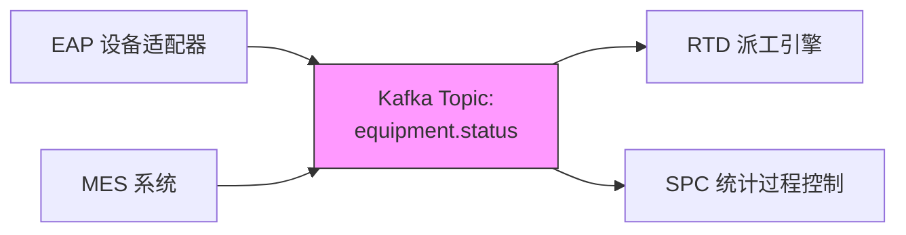

# 2026-05-26 教学记录

共 6 讲

---

## 09:01 | Linux 效率工具

### awk：被你忽略的命令行数据处理神器

📚 [Linux 效率工具] awk：被你忽略的命令行数据处理神器

想象一下：十万行设备日志，老板让你五分钟统计每个机台的平均处理时间。你打开 Excel，导入 → 卡死 → 重启 → 再导入 → 又卡死。旁边的老工程师敲了三行 awk，十秒出结果，端杯咖啡走了。

awk 就是这样一个扫地僧工具 — 平时不起眼，关键时刻一个顶十个。

awk 的思维模型

awk 像流水线质检员：把每行数据按分隔符拆成字段，然后按你的规则检查和处理。默认空格/Tab 分隔，$1 第一列，$2 第二列，$0 整行。

核心句式：awk '条件 {动作}' 文件名

RTD 实战场景

# 1. 提取特定列：从 EQP 日志取机台 ID + 状态（第2、5列）
awk '{print $2, $5}' eqp_status.log

# 2. 条件过滤：找处理时间 >300s 的 Lot（第4列是时间）
awk '$4 > 300 {print $1, $2, $4}' lot_process.log

# 3. 分组统计：各机台处理了多少批货
awk '{count[$2]++} END {for (eqp in count) print eqp, count[eqp]}' production.log

这个 END 块很精妙 — awk 先把所有行读完默默计数，最后一次性输出。本质就是 MapReduce：Map 阶段逐行处理，Reduce 阶段汇总。

BEGIN/END 三段式

BEGIN {初始化变量、打印表头}
      {逐行处理主逻辑}
END   {输出汇总结果}

# 完整示例：计算平均处理时间
awk 'BEGIN {print "===== 报告 ====="; total=0; n=0}
     {total += $4; n++}
     END {printf "共%d批, 平均:%.2f秒\n", n, total/n}' lot_process.log

RTD 工作流中的典型用途

- 解析 EAP 返回日志 → 比 grep 精准，一次提取多个字段
- 分析 TCS 事件流水 → 一行统计事件频率
- 处理 MES 导出 CSV → 比 Python 轻量，零依赖

配合管道更香：
# 最近一小时各机台报警 Top 5
grep "ALARM" /var/log/eqp/$(date +%Y%m%d).log | awk '{print $3}' | sort | uniq -c | sort -rn | head -5

边界意识：超 100 行的逻辑换 Python，需要连数据库也换 Python。但 90% 的日志分析，awk 三行搞定 — 开 Python 反而杀鸡用牛刀。

💡 记住一句话：awk 就是把每行拆成字段，然后对字段做条件+动作。会这一句，你就能处理 90% 的命令行数据分析。

❓ 今日一题
Q: awk 中，哪个内置变量表示「当前行的字段数量」？
A) NR  B) NF  C) FS  D) RS

---

## 10:03 | 数据库

### MySQL 事务隔离级别：为什么你的 RTD 系统偶尔读到幽灵数据

上期答案: D — command &> file 和 command > file 2>&1 都能合并 stdout+stderr 到同一文件。管道中传递 stderr 用 command 2>&1 | next 或 bash 语法糖 command |& next。

📚 [数据库] MySQL 事务隔离级别：为什么你的 RTD 系统偶尔读到"幽灵数据"

想象你在 Fab 厂中控室，屏幕上显示每个 Lot 的实时状态。突然，Lot#2024 同时出现在两台设备的队列里——这不可能！这就是"脏读"：你读到了另一个事务还没提交的数据，而那个事务后来回滚了。

数据库事务隔离级别，就是在"正确性"和"性能"之间划线。四种级别从松到严：

READ UNCOMMITTED — 你能看到别人没提交的修改。RTD 里 A 事务把 Lot 从 E-01 挂到 E-02 但还没 commit，B 就读到了，结果 A 回滚——B 做了错误决策。生产禁用。

READ COMMITTED — Oracle 默认。每次 SELECT 读最新已提交数据。问题是同一事务里两次读同一行可能结果不同（不可重复读）。RTD 报表场景：统计在制 Lot 数量，两次查询对不上。

REPEATABLE READ — InnoDB 默认，靠 MVCC 实现。每行数据藏了三个隐藏列：DB_TRX_ID（最近修改的事务ID）、DB_ROLL_PTR（回滚指针→undo log）、DB_ROW_ID（行ID）。事务只读比自己"老"的版本，就像戴了一副"时间眼镜"——写不阻塞读，读不阻塞写。

SERIALIZABLE — 串行执行，绝对正确但 RTD 秒级响应就别想了。

RTD 实战建议：
  SELECT @@transaction_isolation;            -- 查看当前级别
  SET SESSION TRANSACTION ISOLATION LEVEL READ COMMITTED;  -- 报表用 RC

💡 记住一句话：MVCC 让每个事务看到数据库的"历史快照"——写不阻塞读，读不阻塞写，这就是 InnoDB 支撑 RTD 高并发的核心秘密。

❓ 今日一题
Q: 一个事务执行 SELECT COUNT(*) FROM lots WHERE status='RUNNING'，同一事务内再次执行相同查询结果必须一致——这是哪个隔离级别的保证？
A) READ UNCOMMITTED  B) READ COMMITTED  C) REPEATABLE READ  D) SERIALIZABLE

---

## 11:03 | CI/CD

### CI/CD 流水线实战：从 Git Push 到自动部署

上期答案: C。REPEATABLE READ 隔离级别防止"不可重复读"——同一事务内两次读取同一条记录结果一致。READ COMMITTED 每次读都取最新提交版本，会出现不可重复读。而幻读（Phantom Read）要到 SERIALIZABLE 才彻底杜绝。

---

📚 [CI/CD] CI/CD 流水线实战：从 Git Push 到自动部署

想象一条汽车生产线：钢材进去，经过冲压、焊接、喷漆、组装，最后开出一辆成品车。CI/CD 流水线就是代码界的"生产线"——代码 push 上去，自动经历构建→测试→部署，中间不需要人插手。

先说 CI（持续集成）。核心思想就一条：**别把代码捂在自己电脑上**。频繁 merge 到主干，每次 merge 触发自动构建+跑测试，冲突早发现早解决。你想想 RTD 项目里多人同时改 workflow 脚本，如果每个人都憋一周才合代码，那 merge conflict 能让你怀疑人生。

再说 CD（持续交付/部署）。区别很简单：持续交付 = 构建产物随时可部署，但需要人点"发布"按钮；持续部署 = 连按钮都省了，测试通过直接上生产。大多数 RTD/半导体项目用持续交付就够了——谁敢让 workflow 引擎的改动自动上生产啊？

来看一个真实的 Jenkinsfile（用 Groovy 写的，正好复习）：

```groovy
pipeline {
    agent any
    stages {
        stage('Build') {
            steps {
                sh 'mvn clean package -DskipTests'
            }
        }
        stage('Test') {
            steps {
                sh 'mvn test'
            }
        }
        stage('Deploy to RTD-TEST') {
            when { branch 'develop' }
            steps {
                sh 'scp target/*.jar rtd-server:/opt/workflow/'
            }
        }
        stage('Deploy to PROD') {
            when { branch 'main' }
            steps {
                sh 'scp target/*.jar rtd-prod:/opt/workflow/'
            }
        }
    }
    post {
        failure {
            // 构建挂了？发钉钉/企业微信通知
            sh 'curl -X POST https://hooks.dingtalk.com/...'
        }
    }
}
```

关键概念：
- **Pipeline as Code**：流水线跟着代码走（存在 Jenkinsfile 里），版本可控，谁改了部署逻辑一眼看出
- **Stage 并行**：单元测试和集成测试可以同时跑，不非得串行
- **制品（Artifact）管理**：构建出的 JAR/Docker 镜像存到 Nexus/Harbor，方便随时回滚

RTD 场景最实用的一个点：workflow 脚本改完 push，pipeline 自动把 JAR 部署到 TEST 环境跑冒烟测试。测试挂了？机器人自动钉钉报警。人甚至不用打开 Jenkins 页面。

💡 记住一句话：CI/CD 不是为了自动化而自动化，而是为了让"代码写好到用户能用"这个循环缩到最短。你改一行配置，5 分钟后在 TEST 环境就能验证——这才是 DevOps 的意义。

❓ 今日一题
Q: 关于 CI/CD Pipeline，以下哪项说法是**错误**的？
A) Pipeline as Code 意味着管道定义和源代码一起版本管理
B) CD 可以是 Continuous Delivery（需手动发布）或 Continuous Deployment（全自动）
C) Pipeline 中 Build 阶段必须完全结束后才能开始任何 Test 阶段
D) Jenkinsfile 支持 Declarative 和 Scripted 两种编写风格


---

## 12:01 | Docker

### Docker Compose 网络编排：把 RTD 服务一键拉起

**上期答案: C。** Pipeline 中 Build 阶段完全结束后才能开始 Test 是错的——`parallel` 块让单元测试和集成测试在不同 agent 上同时跑。不与 Build 产物耦合的 Test 阶段完全可以提前并行启动。

---

[K8s/容器] Docker Compose 网络编排：把 RTD 服务一键拉起

假设你要搭一套 RTD 测试环境：EAP 模拟器、MES 数据库、Workflow 引擎、前端看板——四个服务互相依赖。以前怎么做？手动启四个进程，挨个配 IP 端口，祈祷别冲突。Docker Compose 一句话搞定：`docker compose up -d`。

**Compose 不是"Docker 多进程版"，而是"服务编排剧本"。** 你写一个 `docker-compose.yml`，声明有哪些服务、用哪个镜像、端口映射、环境变量、启动顺序，Compose 照剧本执行。

真实 RTD 场景的 Compose 文件：

```yaml
# docker-compose.yml — RTD 测试环境
services:
  postgres:
    image: postgres:16-alpine
    environment:
      POSTGRES_DB: rtd_mes
      POSTGRES_PASSWORD: secret
    volumes:
      - pg_data:/var/lib/postgresql/data
    networks:
      - rtd_net
    healthcheck:
      test: ["CMD", "pg_isready", "-U", "postgres"]
      interval: 5s
      retries: 5

  redis:
    image: redis:7-alpine
    networks:
      - rtd_net

  workflow:
    build: ./workflow-engine
    ports:
      - "8080:8080"
    environment:
      DB_HOST: postgres
      REDIS_HOST: redis
    depends_on:
      postgres:
        condition: service_healthy
      redis:
        condition: service_started
    networks:
      - rtd_net

  eap-simulator:
    image: rtd-eap-sim:latest
    ports:
      - "9090:9090"
    networks:
      - rtd_net

networks:
  rtd_net:
    driver: bridge

volumes:
  pg_data:
```

**关键知识点：**

1. **Docker 网络是"隐形交换机"** — `bridge` 驱动创建虚拟网桥，同一 network 下的容器通过**服务名**互访。`workflow` 连 `postgres` 不需要 IP，直接写 `DB_HOST: postgres`。DNS 解析由 Docker 内置 DNS（127.0.0.11）自动完成。

2. **`depends_on` + `condition` 解决启动顺序** — 早期 Compose 的 `depends_on` 只等容器"启动"不关心"就绪"，postgres 还在初始化 workflow就连上去了，直接报错。`condition: service_healthy`（v3.9+）等 healthcheck 通过才启动下游。没有 healthcheck 的容器如 redis，至少用 `service_started`。

3. **`volumes` 持久化** — 不带 volume 的话容器删了数据就没了。`pg_data` 命名卷存在 Docker 管理的 `/var/lib/docker/volumes/` 下，容器删了数据还在。RTD 测试环境每次重建数据保留，不用重新灌种子数据。

4. **`.env` 文件管理变量** — 不要把密码写死：
```bash
# .env
POSTGRES_PASSWORD=secret
REDIS_PASSWORD=secret
```
然后在 yaml 里用 `${POSTGRES_PASSWORD}` 引用。测试和生产的 `.env` 不同，同一个 Compose 文件通吃。

**RTD 最实用招数：** 用 `docker compose up -d workflow` 只启动 workflow 和它的依赖链（postgres + redis），其他服务不动。联调时不用重启全局。

记住一句话：Docker Compose 的本质是把"服务之间的关系"写成代码——网络互联、启动顺序、环境变量，一个文件交代清楚。

今日一题

Q: 在 Docker Compose 中，以下哪个配置可以确保 postgres 容器**完全就绪**后才启动 workflow？

A) `depends_on: [postgres]`（无 condition）
B) `depends_on: postgres: condition: service_healthy` + postgres 定义 healthcheck
C) `links: [postgres]`
D) `restart: on-failure`

---

## 13:03 | 中间件

### Kafka 消息引擎：RTD 设备的神经中枢

📚 [中间件] Kafka 消息引擎：RTD 设备的"神经中枢"

打个比方：一个半导体工厂里有几百台设备——刻蚀机、光刻机、CVD、检测台。每台设备每秒钟都在产生状态变化："E-01 加工完成 → 等待天车搬运"、"S-03 报 PM 预警 → 需要维护"、"Lot#2048 进入 Bay C"。

如果每个系统（MES、EAP、SPC、RTD）都直接轮询设备状态，就像全公司的人同时打电话问前台"有我的快递吗"——资源全浪费在无效轮询上。Kafka 的做法是：设备把事件丢到"公告栏"上，谁关心谁自己来看。

**Kafka 不是一个"队列"，而是一个"分布式事件流平台"。**

核心角色就四个：
- Producer：发消息的。比如 EAP 适配器把设备事件发到 Kafka。
- Broker：存消息的。Kafka 集群里的服务器节点，消息存磁盘不丢。
- Topic：消息分类。比如 "equipment-events"、"lot-tracking"、"alarm-notify"。
- Consumer Group：消费组。同一组内一个 Partition 只被一个消费者处理，天然负载均衡。

RTD 最经典场景：
设备完成加工 → EAP 发事件到 `equipment.status` → RTD Workflow 消费事件 → 匹配派工规则 → 发指令给天车/操作员。整条链路延迟在毫秒级，而且设备事件被 Kafka 持久化保留 7 天，出了问题随时回溯："这台设备上午 10:03 到底报了啥状态？"

```java
// RTD Producer: 设备状态变更时发消息
kafkaTemplate.send("equipment.status",
    String.format("E-%03d", eqpId),
    "{\"status\":\"IDLE\",\"lotId\":\"L2048\",\"ts\":" + System.currentTimeMillis() + "}"
);

// RTD Consumer: Workflow 引擎监听
@KafkaListener(topics = "equipment.status", groupId = "rtd-dispatch")
public void onEquipmentChange(String msg) {
    EquipmentEvent e = parseEvent(msg);
    dispatchRule.match(e);  // 匹配派工规则
}
```



💡 记住一句话：Kafka 解决的不是"怎么传消息"，而是"怎么让消息被所有需要它的人同时看到，且事后还能翻出来"。

❓ 今日一题
Q: 在 Kafka 中，同一个 Consumer Group 内的多个消费者实例，它们之间的关系是什么？

A) 每个消费者都能收到 Topic 的所有消息（广播）
B) 同一个 Partition 的消息只能被组内一个消费者处理（负载均衡）
C) 消费者之间通过 Zookeeper 互发心跳
D) Consumer Group 内必须有一个 Leader 消费者负责分发消息

---

## 14:02 | 中间件

### Redis 缓存三大经典问题：穿透·击穿·雪崩

**上期答案: B。** 同一个 Consumer Group 内，每个 Partition 只分配给一个消费者——这是 Kafka 实现负载均衡的核心机制。一个 Topic 有 4 个 Partition，组内 4 个消费者各领一个，消息并行处理。如果消费者数超过 Partition 数，多出来的消费者会闲置待命。想广播？用不同 Consumer Group。

---

📚 **[中间件] Redis 缓存三大经典问题：穿透 · 击穿 · 雪崩**

这三个词听起来像武侠招式，实际上就是缓存没挡住请求时发生的三种翻车现场。用半导体工厂的 RTD 场景来讲，特别好懂。

**场景设定**：你的 RTD Workflow 引擎每次做派工决策，都要查设备状态、Lot 优先级、Recipe 参数。每次都查数据库太慢，于是加了一层 Redis 缓存。

---

**① 缓存穿透 — 查一个根本不存在的东西**

比如有人传了一个不存在的 Lot ID（L-99999），缓存里没有，数据库里也没有。请求每次都穿透缓存直击数据库。恶意攻击者用大量不存在 ID 疯狂请求，数据库直接被打崩。

比喻：就像有人天天来前台问"张三在吗"，前台翻遍花名册说没有，但每次都要从头翻一遍。

解法——布隆过滤器（Bloom Filter）：
  RBloomFilter<String> lotFilter = redisson.getBloomFilter("lot:bloom");
  lotFilter.tryInit(100000L, 0.03);  // 10万条，3%误判率
  if (!lotFilter.contains("L-99999")) return null; // 一定不存在

---

**② 缓存击穿 — 一个热点 Key 刚好过期**

某个设备的状态 Key 过期了，恰好此刻 100 个并发请求同时到达——全部 miss，全部冲去查数据库。一个点失效，瞬间千军万马踩过去。

比喻：商场限时抢购，热门商品展台刚好撤了，所有人同时冲到仓库门口。

解法——互斥锁（分布式锁）：
  RLock lock = redisson.getLock("lock:eqp:" + eqpId);
  if (lock.tryLock(3, 10, TimeUnit.SECONDS)) {
      // Double-check + 查库 + 写缓存，只让一个人查
  }

---

**③ 缓存雪崩 — 大批 Key 同时过期**

你在凌晨批量刷新所有设备状态缓存，TTL 全设成一样的。半小时后几百个 Key 同时过期——Redis 瞬间变成透明人，所有请求砸向数据库。

解法——TTL 加随机扰动：
  int ttl = 300 + ThreadLocalRandom.current().nextInt(-90, 90);
  redis.setex("eqp:E-01:status", ttl, status);

---

💡 **记住一句话：穿透防不存在（布隆过滤器），击穿防一个点（互斥锁），雪崩防同时死（TTL 随机化）。三个问题，三个解法。**

---

❓ **今日一题**
Q: 在 RTD 系统中，某个热门设备的状态缓存过期后，100 个并发请求同时冲去查数据库。这个现象叫什么？应该怎么解决？
A) 缓存穿透 — 用布隆过滤器
B) 缓存击穿 — 用互斥锁（分布式锁）
C) 缓存雪崩 — 给 TTL 加随机扰动
D) 缓存预热 — 提前加载所有数据到 Redis

---

