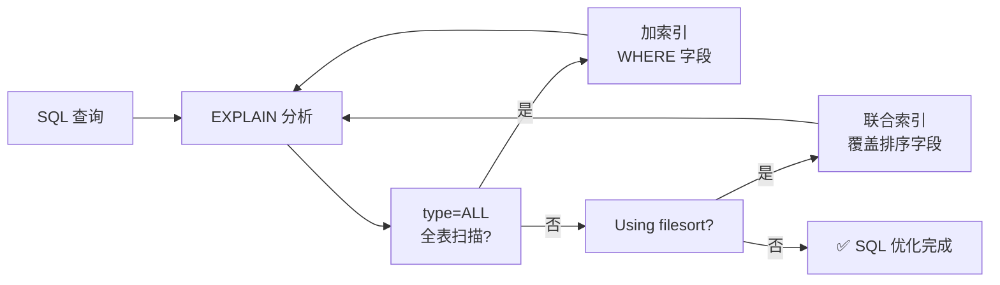
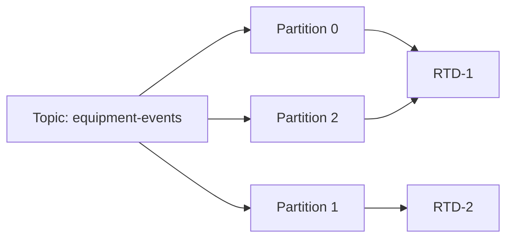

# 2026-05-28 教学记录

共 7 讲

---

## 09:18 | 容器编排

### 让 RTD 服务永不掉线：K8s 健康检查与自愈机制

上期答案: E

xargs -P 4 和 parallel -j 4 都能限制并发数。& 把所有任务同时扔后台不设上限，wait 只是等它们跑完，screen 是会话管理工具跟并发控制无关。

---

📚 [容器编排] 让 RTD 服务永不掉线：K8s 健康检查与自愈机制

想象一下：你有一台半导体机台，上面跑着 RTD 派工服务。凌晨三点，这个服务突然挂了——不是进程崩溃（那还好，systemd 会帮你拉起来），而是它「活着但傻了」：端口还开着，但所有请求都超时，因为内部线程死锁了。

这就是 Kubernetes 需要三种探针的原因。

Liveness Probe：你还活着吗？

最简单的健康检查，回答一个问题：「这个容器还活着吗？」如果连续失败，kubelet 直接杀掉容器重建：

livenessProbe:\n  httpGet:\n    path: /healthz\n    port: 8080\n  initialDelaySeconds: 30\n  periodSeconds: 10\n  failureThreshold: 3

对于 RTD 服务，/healthz 不能只是 return 200——你得在端点里跑一个轻量自检：数据库连接池正常吗？消息队列能通吗？

但是 Liveness 太粗暴了——重建会丢状态。所以我们需要 Readiness。

Readiness Probe：你能接客了吗？

Pod 启动 -> Liveness OK -> Readiness? -> NO: 摘除流量 / YES: 加入负载均衡

Readiness 决定流量是否路由给你。RTD 服务启动时可能需要连 EAP 设备、加载配方表——这期间不能让派工请求打进来。Readiness 失败不会杀容器，只是把它从 Service 的 Endpoints 里摘掉：

readinessProbe:\n  exec:\n    command:\n    - /app/rtd_ready.sh\n  periodSeconds: 5\n  failureThreshold: 2

Startup Probe：给慢启动的容器一条活路

有些 RTD 服务（尤其是 Java 写的，比如 Spring Boot 的派工引擎）启动可能 60-90 秒。如果 Liveness 的 initialDelaySeconds 设太短，服务还没起来就被杀了——「死循环重启」。Startup Probe 专门解决这个：

startupProbe:\n  httpGet:\n    path: /actuator/health\n    port: 8080\n  failureThreshold: 30\n  periodSeconds: 5

Startup 成功之后，Liveness 和 Readiness 才接管。一次配置，告别冷启动被误杀。

实战建议：
1. 三种探针都配，不要省。RTD 服务的 SLA 要求高。
2. Liveness 的 failureThreshold 设 3-5 次，避免网络抖动误杀
3. Readiness 的检查频率可以比 Liveness 高（流量切换要快）
4. Java 服务一定配 Startup Probe

💡 记住一句话：Liveness 管生死（重启），Readiness 管流量（摘除），Startup 管冷启动（给时间）。三个探针一起用，RTD 服务才能真正自愈。

❓ 今日一题
Q: 一个 K8s Pod 的 Readiness Probe 连续失败后，Pod 会发生什么？
A) Pod 被删除重建  B) Pod 仍在，但 Service 不再转发流量给它  C) Pod 被暂停  D) 自动回滚到上一个版本

---

## 10:02 | 容器编排

### Kubernetes 健康检查：让 RTD 服务实现自愈

📚 容器编排 · Kubernetes 健康检查：让 RTD 服务实现自愈

想象一下：深夜 2 点，你的 RTD 派工引擎跑得好好的，突然它不响应了——进程还在，端口开着，但就是不通。K8s 怎么发现这种「假死」？

K8s 提供了三个「健康医生」，它们定期给 Pod 做体检。

Liveness Probe — 心跳检测：「你还活着吗？」如果连续失败，K8s 直接杀掉容器重启。就像一个急诊医生：心脏骤停？立刻 CPR。

Readiness Probe — 上岗体检：「你现在能干活吗？」如果失败，K8s 停止往这个 Pod 发请求，但不杀它。就像一个打工人临时请假：今天不舒服不接活，但没被开除。

Startup Probe — 入职缓冲期：「你启动完了没？」只跑一次，在此期间暂停其他探针。避免慢启动的应用（比如要加载一堆设备驱动的 RTD 服务）还没初始化完就被 liveness 误杀了。

这三个 Probe 各管一段生命周期，形成一个完整的「自愈」链：

（Mermaid 流程图：Pod启动 → Startup → Liveness → Readiness → 接收/暂停流量）

来看一个 RTD 设备通信服务（ECS）的真实配置。它上来要加载 SECS/GEM 驱动、建立到 50 台设备的连接，启动需要 40 秒：

startupProbe:
  httpGet:
    path: /health/startup
    port: 8080
  initialDelaySeconds: 5
  periodSeconds: 10
  failureThreshold: 10  # 最多等 105 秒
livenessProbe:
  httpGet:
    path: /health/live
    port: 8080
  periodSeconds: 15       # 每 15 秒测一次心跳
readinessProbe:
  httpGet:
    path: /health/ready
    port: 8080
  periodSeconds: 10
  failureThreshold: 3     # 连续 3 次失败就摘流

后端实现要分清「能修」和「该等」：

// Liveness: 判断"重启有用吗"——只检查进程自身的致命状态
func liveHandler(w http.ResponseWriter, r *http.Request) {
    // 不要在这里检查 DB/Redis 连接！
    // 只检查 goroutine 死锁、内存泄漏等自身问题
    w.WriteHeader(200)
}

// Readiness: 判断"能接客吗"——检查对外依赖
func readyHandler(w http.ResponseWriter, r *http.Request) {
    if connPool.Available() < 10 {
        w.WriteHeader(503) // 连接池不够了，暂时免打扰
        return
    }
    w.WriteHeader(200)
}

实战避坑：① Liveness 别依赖外部服务——DB 慢 3 秒就重启 Pod，只是把雷扫到别处；② Startup 的 failureThreshold 要乘 periodSeconds，算出最大启动容忍时间；③ Readiness 失败时，同 Service 下的其他 Pod 还能扛，这才是真高可用——就像半导体产线，一台机台报警降产，其他机台继续跑。

💡 记住一句话：Liveness 决定「要不要重启」，Readiness 决定「能不能接单」，Startup 决定「给你多少时间准备好」。

❓ 今日一题
Q: RTD 派工服务依赖 Redis 缓存。某天 Redis 故障但服务进程正常。此时哪种探针最合适触发保护？
A) Liveness Probe 重启 Pod
B) Readiness Probe 停止流量分发
C) Startup Probe 延迟启动
D) 三个探针同时使用

---

## 11:05 | 开发工具链

### Git 后悔药：reset、revert、reflog

上期答案: B\n\nRedis 是外部依赖，服务进程本身健康。Readiness Probe 应该停止流量分发——把 Pod 从负载均衡里摘掉，等 Redis 恢复后自动重新上线。重启 Pod（Liveness）治标不治本，新 Pod 启动后还是连不上 Redis，死循环重启只会让问题更糟。\n\n---\n\n📚 [开发工具链] Git 后悔药：reset、revert、reflog\n\n你刚提交了一个 commit，跑完 CI 才发现——把生产数据库密码写进配置文件了。怎么办？\n\nGit 给了三颗「后悔药」，力度递增：\n\n① git revert — 礼貌的撤回\n\n就像发了一条错误的工作消息，不是删掉它，而是再发一条「上条撤回」。revert 会生成一个新的 commit，内容跟目标 commit 完全相反，历史记录完整保留。\n\ngit revert abc1234\n\n适合：已 push 到远程的公共分支。不要改历史，追加修正。\n\n② git reset — 暴力回溯\n\n相当于「刚才那几步不算，我们重新来」。三种力度：\n\ngit reset --soft HEAD~1   # 撤回 commit，改动留在暂存区\ngit reset --mixed HEAD~1  # 撤回 commit+暂存，改动留在工作区\ngit reset --hard HEAD~1   # 全删！\n\n适合：本地分支，还没 push。--soft 最安全，--hard 要谨慎。\n\n③ git reflog — 后悔药吃错了还有救\n\n你 reset --hard 之后发现撤错了？别慌，Git 把所有 HEAD 移动都记在 reflog 里，默认保留 90 天：\n\ngit reflog\n# abc1234 HEAD@{0}: reset: moving to HEAD~1\n# def5678 HEAD@{1}: commit: 修复派工逻辑\n\ngit reset --hard HEAD@{1}  # 回到 reset 之前！\n\nRTD 场景：半导体产线的派工规则经常调整。用 revert 撤回错误变更，用 reflog 防手滑。分支策略：main ← develop ← feature/xxx，永远别直接在 main 上 reset。\n\n💡 记住一句话：revert 追加修正，reset 回退历史，reflog 兜底一切。push 过了只用 revert，本地随便 reset 有 reflog 撑腰。\n\n❓ 今日一题\nQ: 你不小心在 main 分支上 git reset --hard HEAD~3，丢了三个 commit。哪个命令能救回来？\nA) git revert HEAD~3\nB) git checkout HEAD@{before-reset}\nC) git reflog 找到 reset 前的 commit 再 reset --hard\nD) git pull --force origin main

---

## 12:03 | 数据库

### MySQL 慢查询克星：三分钟看懂 EXPLAIN 执行计划

上期答案: C

git reflog 记录了所有 HEAD 移动，即使 git reset --hard 后也能找回。先用 git reflog 找到 reset 前的 commit hash，再 git reset --hard 回去即可。A 是追加新 commit，不能找回丢失的代码。B 语法不存在（checkout 不接受 HEAD@{...} 参数）。D 拉远程覆盖本地——前提是已经 push 过，如果没 push 就真丢了。

---

📚 [数据库] MySQL 慢查询克星：三分钟看懂 EXPLAIN 执行计划

你写的 SQL 跑开发环境 0.01 秒，上生产 30 秒。DBA 丢过来一句「看看执行计划」。什么是执行计划？就是 MySQL 优化器写给你的「行车路线图」——告诉你它是怎么找到数据的。

打开这个路线图只需要一个词：

EXPLAIN SELECT * FROM wafer_lot WHERE status = 'RUNNING' AND fab = 'FAB1';

输出一张表，下面逐列拆解——先看最关键的三列：

① type：访问方式——这一列决定了查询快慢

从好到坏排列：const > eq_ref > ref > range > index > ALL

ALL 就是全表扫描，几百万行数据一行一行比对——相当于在字典里查一个词，不从拼音索引找，而从第一页翻到最后一页。type=ALL 出现就要警惕。

ref 是走索引查找，比如 WHERE fab='FAB1' 用了 fab 字段的索引——就像从字典的拼音索引直接翻到对应页。

② key：实际用的索引

这一列告诉你的 SQL 到底走了哪个索引。如果是 NULL，说明没用到索引——要么没建，要么建的没用上。半导体产线常见场景：WHERE create_time > '2026-05-01' AND status='RUNNING'，建了 (create_time, status) 联合索引，但 key 显示只用到了 create_time——这就引出了下一列。

③ Extra：额外信息——这列是宝藏

Using index：覆盖索引，查询不用回表，最优。
Using where：在存储引擎层之外做了额外过滤。
Using filesort：需要额外排序——排序字段没走索引时会触发，是性能杀手。
Using temporary：用临时表，GROUP BY 或 DISTINCT 字段没索引时常见。

来看一个真实优化案例：

EXPLAIN SELECT lot_id, status, update_time 
FROM wafer_lot 
WHERE fab='FAB1' AND status='RUNNING' 
ORDER BY update_time DESC LIMIT 20;

执行计划显示：type=ref, key=fab_idx, Extra=Using where; Using filesort

Rows 是 50 万——说明 fab='FAB1' 过滤后还有 50 万行，排序又触发 filesort。怎么优化？建联合索引 (fab, status, update_time)：

CREATE INDEX idx_fab_status_time ON wafer_lot(fab, status, update_time);

再 EXPLAIN：type=ref, key=idx_fab_status_time, Extra=Using index——没有 filesort 了！因为联合索引本身就有序，ORDER BY update_time 直接走索引顺序。



RTD 场景：半导体产线的 wafer lot 状态表动辄千万行，Reticle 使用历史表更大。每次 RTD 派工都要查「当前可用的 Lot」和「匹配的 Reticle」——这两条 SQL 的执行计划决定了整个派工引擎的响应时间。上线前 EXPLAIN 一遍，把 ALL 和 filesort 消灭掉。

💡 记住一句话：EXPLAIN 的 type 列是 SQL 体检报告——看到 ALL 就加索引，看到 filesort 就建联合索引覆盖排序字段。

❓ 今日一题
Q: EXPLAIN 输出的 type 列有几种访问类型。以下哪个是「最差」的，代表全表扫描？
A) ref
B) range
C) ALL
D) index

---

## 13:03 | 中间件

### Kafka 消费者组与偏移量管理

上期答案: C — EXPLAIN type=ALL 是全表扫描，意味着没有用到索引，数据库要逐行扫描整张表。

📚 [中间件] Kafka 消费者组：让 RTD 派工消息「一个都不多、一个都不少」

想象你是一家半导体 Fab 的 RTD 派工系统。几百台机台每秒钟都在上报状态：E-01 空闲了、S-03 报警了、M-02 加工完成了……这些事件像洪水一样涌进 Kafka Topic。问题来了：你有 3 台 RTD 服务实例同时在消费，怎么保证同一条消息不会被重复处理，又不会漏掉？

答案就是 Consumer Group + Partition 的绑定机制。



Kafka 的核心规则：同一个 Partition 在同一时刻，只会被 Consumer Group 内的一个消费者消费。这保证了消息在 Partition 内的严格顺序——对于 RTD 来说这太重要了：机台 E-01 的「报警」和「解除报警」必须按先后顺序处理，不能反过来。

消费者多了怎么办？如果 Topic 只有 3 个 Partition，但你起了 4 个 RTD 实例，第 4 个实例会干等着——没有任何 Partition 分给它。Kafka 不会自动「均分」，多出来的消费者就是闲置的。所以 Partition 数量 ≥ 消费者数量，这是一条铁律。

Offset：消费进度「书签」。每条消息在 Partition 内有一个递增的 Offset（偏移量），消费者处理完一条就提交当前位置。重启后从上次的 Offset 继续——不会重复消费也不会漏。但这里有个坑：如果先处理业务再提交 Offset（at-least-once），挂了会重复处理；如果先提交再处理（at-most-once），挂了就丢了消息。

RTD 场景的最佳实践：用一个唯一 ID（比如 event_id）做幂等校验——即使同一条消息被处理了两次，数据库里 INSERT ... ON DUPLICATE KEY UPDATE 也能保证最终结果一致。这就是「至少一次 + 幂等 = 精确一次」的黄金公式。

```java
// RTD 消费端幂等处理示例
@KafkaListener(topics = "equipment-events")
public void onEvent(EquipmentEvent event) {
    // 幂等插入：重复 event_id 自动忽略
    jdbc.update(
        "INSERT INTO rtd_events (event_id, eqp_id, status) " +
        "VALUES (?,?,?) ON DUPLICATE KEY UPDATE status=status",
        event.getId(), event.getEqpId(), event.getStatus()
    );
}
```

💡 记住一句话：一个 Partition 一个消费者，顺序不乱；幂等兜底，不怕重来。

❓ 今日一题
Q: 一个 Topic 有 5 个 Partition，Consumer Group 里有 3 个消费者。此时再新增 1 个消费者，会发生什么？
A) 5 个 Partition 被 4 个消费者均分  B) 触发 Rebalance，3 个消费者中有一个释放 Partition 给新消费者  C) 新消费者闲置，等下次 Rebalance  D) Kafka 自动创建新 Partition

---

## 14:04 | 效率工具

### 正则表达式实战：RTD 日志分析的瑞士军刀

上期答案: B — 触发 Rebalance，Partition 重新分配给所有消费者。当 Consumer Group 中有新消费者加入，Kafka 协调器会暂停所有消费，将 Partition 重新分配。这也是为什么 RTD 系统要尽量避免频繁 Rebalance：每次 Rebalance 期间整个 Group 都停止消费，实时派工会受影响。\n\n---\n\n📚 [效率工具] 正则表达式实战：RTD 日志分析的瑞士军刀\n\n半导体 Fab 的 EAP 日志一天几百兆。设备报警时，你需要在几万行里把 E-03 的 SECS/GEM 交互消息捞出来——用眼睛翻得翻到明天。正则表达式就是你的「超级搜索框」。\n\n① 基础匹配 — 字符类和锚点\n\n```bash\ngrep 'E-0[1-5]' equipment.log      # [1-5] 字符类：匹配 E-01 到 E-05\ngrep '^\[ERROR\].*E-03' app.log     # ^ 行首、.* 任意内容\ngrep 'ALARM_[0-9]\{6\}$' app.log    # $ 行尾，\{6\} 重复6次\n```\n\n② 分组捕获 — 把关键数据「抠」出来\n\nSECS/GEM 日志格式：E-03|EventReport|CEID=101|Timestamp=20260528140025\n\n```bash\nsed -n 's/.*CEID=\([0-9]\+\).*/\1/p' secsgem.log\n# \( \) 是捕获组，\1 引用第一个组，-n + /p 只打印匹配行\n```\n\n③ awk + 正则 — RTD 日志统计分析\n\n```bash\nawk '/ALARM.*E-03/ {alarm_count++} END {print "E-03 报警:", alarm_count}' equipment.log\n```\n\nRTD 实战：Trace 数据格式 Reticle=RET001|Lot=L240528A|Step=PHOTO_LAYER3\n\n```bash\nawk -F'[|=]' '/Step=PHOTO/ {print "Reticle:", $2, "Lot:", $4}' trace.log\n# -F'[|=]' 把 | 和 = 都当分隔符，$2 $4 自动对齐\n```\n\n```mermaid\ngraph LR\n    A["grep 过滤\\n按模式筛行"] --> B["sed 替换\\n提取/修改文本"]\n    B --> C["awk 计算\\n按列条件统计"]\n    C --> A\n```\n\n💡 记住一句话：正则不是在学语法，是在学「描述」——你要抓的东西长什么样，就怎么写。grep 筛行、sed 改内容、awk 算数据，三件套打天下。\n\n❓ 今日一题\nQ: 日志行 E-01|Pressure=3.2|Temp=850，哪个正则能匹配到温度值 850？\nA) Temp=[0-9]\nB) Temp=[0-9]+\nC) Temp=([0-9]+)\nD) Temp=\\"[0-9]+\\" 

---

## 15:03 | Docker

### Docker容器排障三板斧：出问题先做这三件事

上期答案: C — Temp=([0-9]+) 不仅能匹配到温度值 850，括号还能把它捕获出来供后续引用。A 的 [0-9] 只匹配单个数字（捕获 "8" 而非 "850"），B 虽然能匹配但不能捕获，D 要求引号包裹（输入里没有引号）。在实际 RTD 日志提取中，捕获组就是用来「抠」数据的。\n\n---\n\n📚 [Docker] 三分钟排障：容器出问题，先做这三件事\n\n半导体产线的 RTD 服务跑在 Docker 里。某天凌晨 3 点告警：派工引擎挂了。你睡眼惺忪打开终端——该从哪下手？教你这三板斧，90% 的问题都能定位到。\n\n第一斧：docker logs — 看日志，别瞎猜\n\n容器不像虚拟机，你没有 /var/log 可翻。所有标准输出和标准错误都汇流到 Docker 的日志驱动里：\n\n```bash\ndocker logs --tail 100 rtd-engine        # 最后 100 行\ndocker logs -f --since 10m rtd-engine    # 实时跟踪最近 10 分钟\ndocker logs --timestamps rtd-engine | grep ERROR  # 带时间戳的报错\n```\n\n提醒：Java 应用默认把日志写到文件（logback/spring），容器里 stdout 是空的！得配 ConsoleAppender 或启动时加参数让日志输出到控制台，否则 `docker logs` 什么也看不到——这是 RTD 容器化最常见的坑。\n\n第二斧：docker exec — 进入容器现场取证\n\n看日志还不够，你需要进去看看进程状态、文件系统、网络连接：\n\n```bash\ndocker exec -it rtd-engine /bin/sh    # 进去\nps aux | grep java                     # 看进程活着吗\ndf -h                                  # 磁盘满了没\nnetstat -tlnp                          # 端口监听正常吗\ncat /proc/1/status | grep -i vm       # 看看 OOM 了没\n```\n\nRTD 实战场景：机台通讯断了。进去 `curl -v http://eqp-e03.mfg.internal:8080/api/status` 测试网络连通性，往往发现是 DNS 没配好或者 hosts 里少了一行。\n\n第三斧：docker inspect — 还原犯罪现场\n\n出问题时容器的配置是什么？端口映射对了没？挂载的卷还在不在？\n\n```bash\ndocker inspect rtd-engine | jq '.[0].HostConfig.PortBindings'  # 端口映射\ndocker inspect rtd-engine | jq '.[0].Mounts'                    # 挂载卷\ndocker inspect rtd-engine | jq '.[0].State'                     # 运行状态\n```\n\n最常见的事故：运维改了 docker-compose.yml 的端口映射但没重启容器——`docker inspect` 一看还是旧端口，真相大白。\n\n```mermaid\ngraph LR\n    A["docker logs<br/>看日志"] --> B["docker exec<br/>进容器"]\n    B --> C["docker inspect<br/>查配置"]\n    A --> C\n    style B fill:#39f,stroke:#333,color:#fff\n```\n\n这三板斧的排查顺序是固定的：先看日志定位症状 → 再进容器看现场 → 最后查配置确认根因。就像医生看病：先问症状，再检查，最后看化验单。\n\n💡 记住一句话：容器没有 /var/log，docker logs 就是你的眼睛；看不到日志先查 Java 是不是只写文件没写 stdout。\n\n❓ 今日一题\nQ: `docker logs container-name` 默认读取的是容器的什么输出？\nA) 容器内 /var/log/app.log 文件\nB) 容器内所有文件，递归扫描\nC) 容器的 stdout 和 stderr\nD) Docker daemon 的日志

---

