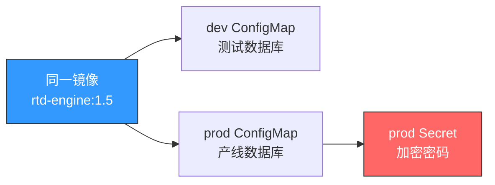
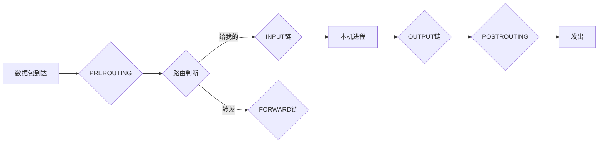

# 2026-05-29 教学记录

共 4 讲

---

## 09:20 | Git

### Git rebase vs merge：让 commit 历史像 Fab 产线一样干净

上期答案: C — sar 默认每 10 分钟采集一次系统性能数据。它由 sysstat 包的 cron 任务驱动（/etc/cron.d/sysstat），每 10 分钟执行一次 sa1 采集脚本。A 的 1 分钟是 pidstat 的默认粒度，B 的 5 分钟和 D 的 30 分钟都是错误选项。sar 的 10 分钟粒度适合看中长期趋势——如果故障只持续几十秒，记得配合 pidstat 做秒级补充。

---

📚 [Git] rebase vs merge：让 RTD 工作流的 commit 历史像 Fab 产线一样干净

你有没有遇到过这种 Git 历史：

```
* Merge branch 'main' into feat-rtd-scheduler
|\
| * some fix on main
* | Merge branch 'main' into feat-rtd-scheduler
|\|
| * another fix
* | my scheduler change
```

仿佛毛线团一样纠缠不清。这是因为你每次同步主分支都用了 `git merge`。还有一种更干净的方式——**rebase**。

**merge vs rebase：一句话理解**

`merge` 是「把两条线合到一起」，产生一个合并节点。`rebase` 是「把 feat 分支的提交搬到 main 的最新节点上重新应用」，历史是一条直线。

```bash
# merge 方式（毛线团）
git checkout feat-rtd-scheduler
git merge main              # 产生一个 merge commit

# rebase 方式（一条直线）
git checkout feat-rtd-scheduler
git rebase main             # 把 feat 的提交"平移"到 main 顶端
# 如有冲突：解决后 git add . && git rebase --continue
```

**RTD 实战场景**

你在 `feat-rtd-scheduler` 分支上开发派工调度逻辑，花了三天。这三天里 main 分支进了 5 个 hotfix。如果最后用 merge 合回去，你的 PR 历史就是一张蜘蛛网。

更优雅的做法：每天下班前 `git rebase main` 一次，把别人的改动同步过来，顺便解决冲突。最后提 PR 时，你的分支就像是在最新代码上长出来的一样干净。

**interactive rebase：整理自己的提交**

三天开发你可能有 15 个 commit："WIP"、"fix typo"、"又改了一下"……直接推到远程丢人。用 `rebase -i` 整理：

```bash
git rebase -i HEAD~5   # 整理最近 5 个 commit
# 编辑器弹出：
# pick abc123 feat: add scheduler
# squash def456 WIP: temp save
# squash ghi789 fix: typo
# reword jkl012 update: optimize perf
# pick mno345 feat: add unit tests
```

`squash` 把 WIP 和 typo 合进 scheduler 这个 commit，`reword` 改措辞，`pick` 原样保留。5 个 commit 变成 3 个清晰的 commit，review 的人会感谢你。


**⚠️ 黄金法则：永远不要 rebase 已经 push 过的分支**

Rebase 改写的是 commit 历史（hash 会变）。如果你已经 push 到远程，别人基于你的分支开发，你 rebase 后再 force push——别人的本地分支就全乱了。记住：**rebase 只发生在你本地、还没 push 的私有分支上。**

对于 RTD 团队协作，我的建议是：feature 分支上随意 rebase，一旦 push 并且有人基于你的分支工作，就改用 merge。干净和协作之间，协作优先。

💡 **记住一句话：merge 保留真相，rebase 书写历史——开发中的 feature 分支用 rebase 保持干净，公共分支用 merge 保留完整轨迹。**

---

❓ **今日一题**
Q: 关于 git rebase，以下哪个说法是正确的？
A) rebase 后必须 force push，这是标准操作
B) rebase 会改写 commit 的 hash，所以不能 rebase 已 push 的公共分支
C) rebase 会自动解决所有冲突，无需手动处理
D) rebase 和 merge 效果完全一样，只是命令不同

---

## 10:10 | Groovy

### Groovy 闭包与 DSL：像搭积木一样写 RTD 派工规则

上期答案: **B** — rebase 会改写 commit 的 hash，所以不能 rebase 已经 push 到远程的公共分支。一旦有人基于你的分支开发，rebase 之后 force push 会让他人的本地仓库彻底乱掉。feature 分支上随便 rebase，但 push 之后有协作就改用 merge——干净和协作之间，协作优先。

---

📚 [Groovy] 闭包与 DSL：像搭积木一样写 RTD 派工规则

想象你在组装一台设备——每个零件（参数）都可以按需组合，不需要重写整个说明书。Groovy 的闭包就是这种「可配置的代码积木」，而用它搭出来的 DSL（领域特定语言）让 RTD 派工规则从几百行 if-else 变成几行英文一样的描述。

**闭包是什么？**

闭包是「带记忆的函数」。它不仅能执行代码，还能记住自己被创建时的上下文。在 RTD 系统里，你经常需要「先定义规则，后执行」——闭包天然适合这个模式。

```groovy
def dispatchRule = { lot ->
    if (lot.priority > 5 && lot.holdStatus == 'NONE') {
        return "DISPATCH"
    }
    return "HOLD"
}
println dispatchRule(currentLot)
```

**delegate 策略：闭包的核心武器**

闭包的 delegate 属性决定了方法查找的起点。Groovy 有四种策略：OWNER_FIRST、DELEGATE_FIRST、OWNER_ONLY、DELEGATE_ONLY。

**重点：默认是 OWNER_FIRST！** 很多人踩坑就是因为忘了改 delegate 策略。在写 DSL 时，如果不把 delegate 设成 DELEGATE_FIRST，你定义在 DSL 上下文里的方法调用全跑到外层类去找了——结果就是 MethodMissingException，排查半天才发现策略没改。

**用闭包搭建 DSL：RTD 实战**

在半导体 RTD 里，派工逻辑可能一天改好几次（产线调整、紧急批次、设备状态变化）。用传统 Java 写，改一次编译一次部署一次。用 Groovy DSL，直接改配置文本，热加载生效：

```groovy
// rtd_rules.groovy — 生产环境直接热加载
dispatch {
    when {
        equipment.type == "ETCH" && lot.step == "METAL_ETCH"
    }
    then {
        assignTo equipment.where { status == "IDLE" && pmRemaining > 100 }
        notify "蚀刻机台派工完成"
    }
}

dispatch {
    when { lot.priority >= 8 }
    then {
        skipQueue = true
        bypassPMCheck()
        alert "SUPER_HOT_LOT: ${lot.id} 已跳过排队"
    }
}
```

这种 DSL 有三个好处：① 产线工程师也能看懂——语法像英文句子；② 热加载——不用重启 RTD 服务，改完规则立刻生效；③ 版本控制友好——规则文件和代码一样进 Git，谁改的什么时候一清二楚。

💡 **记住一句话：闭包是 Groovy 的超级能力——默认 OWNER_FIRST 策略决定了方法查找的起点，delegate 则是 DSL 的灵魂，让 RTD 规则从「写代码」变成「写描述」。**

---

❓ **今日一题**
Q: Groovy 闭包的 delegate 策略，默认值是什么？
A) DELEGATE_ONLY  B) DELEGATE_FIRST  C) OWNER_FIRST  D) OWNER_ONLY

---

## 11:04 | K8s

### K8s ConfigMap & Secret：RTD 配置管理的正确姿势

上期答案: **C** — Groovy 闭包的 delegate 策略默认值是 OWNER_FIRST。这意味着闭包内的方法调用先在 owner（定义闭包的类/对象）里找，找不到才会去 delegate 里找。写 DSL 时如果不显式设成 DELEGATE_FIRST，你定义在 DSL 上下文里的方法调用全跑到外层类去找了，直接 MethodMissingException。记住：OWNER_FIRST 是捡自家钥匙，DELEGATE_FIRST 是先去邻居家找——写 DSL 时记得把邻居钥匙放门口。

---

📚 [K8s] ConfigMap 与 Secret：别把 RTD 密码写死在代码里

想象你在管理一个半导体 Fab 的 RTD 系统。开发环境连的是测试数据库，生产环境连的是产线数据库——连接地址、用户名、密码全不一样。最笨的办法是什么？在代码里写 if-else 判断环境。稍微好点的？写个 application.properties。但 K8s 给了你一个更优雅的答案：ConfigMap 和 Secret。

**ConfigMap：管配置**

ConfigMap 把配置从镜像里剥离出来。镜像保持通用，配置按环境注入——同一个镜像，dev 和 prod 两套 ConfigMap，行为完全不同：

```yaml
# rtd-config.yaml
apiVersion: v1
kind: ConfigMap
metadata:
  name: rtd-config
data:
  db.host: "10.0.1.50"
  db.port: "3306"
  dispatch.interval: "30"
  equipment.timeout: "5000"
```

Pod 里两种用法：**挂载成文件**（适合配置文件）或**注入成环境变量**（适合简单键值）：

```yaml
# Pod 中引用
envFrom:
- configMapRef:
    name: rtd-config        # 所有 key 变成环境变量
volumeMounts:
- name: config
  mountPath: /etc/rtd/config.yaml
  subPath: config.yaml
```

**关键区别：挂载为文件会热更新**（kubelet 定期同步，Pod 里文件内容自动刷新）。环境变量注入后**不会变**——Pod 不重启就不更新。RTD 的派工规则、设备参数放文件挂载最合适，改完 30 秒内生效，不用重启 Pod。

**Secret：管密码**

数据库密码、API Key、证书——这些如果写进 ConfigMap，`kubectl describe` 一眼就能看到。Secret 专门存敏感数据，值必须 base64 编码：

```yaml
apiVersion: v1
kind: Secret
metadata:
  name: rtd-secret
type: Opaque
data:
  db.password: cm9vdDEyMzQ1Ng==        # echo -n "root123456" | base64
  api.key: c2VjcmV0LWtleS0yMDI2
```

Secret 存储在 etcd 中默认不加密（新版本可开启 EncryptionConfiguration），使用时和 ConfigMap 一样——挂载为文件或注入环境变量。

**RTD 实战：一套镜像，三套环境**



dev、staging、prod 三套 ConfigMap + Secret，同一个镜像到处跑。改配置不用重新构建镜像和 CI/CD，`kubectl apply -f configmap.yaml` 搞定。

💡 **记住一句话：ConfigMap 放配置、Secret 放密码、文件挂载能热更新——把 RTD 的「改配置=重构建+重部署」变成「改配置=一行 kubectl」。**

---

❓ **今日一题**
Q: K8s 中，ConfigMap 的以下哪种注入方式支持热更新（不重启 Pod 即可生效）？
A) 通过 envFrom 注入为环境变量
B) 通过 volumeMount 挂载为文件
C) 以上两种都支持
D) 以上两种都不支持


---

## 12:04 | 安全

### iptables 防火墙实战：保护 RTD 服务器的第一道防线

上期答案：B

ConfigMap 既可以作为环境变量（envFrom / valueFrom），也可以作为文件挂载（volumes + volumeMounts）到 Pod 中。环境变量方式适合少量简单配置，文件挂载方式支持热更新、适合配置文件场景。两种方式可以同时使用。

---

📚 🔒 安全 | iptables 防火墙实战：保护 RTD 服务器的第一道防线

想象你是 Fab 厂的安保主管。厂区有几个门，每个门都有不同的放行规则：正门只放行有工卡的员工，后门只允许物流车进出，机房的门只允许 IT 人员。iptables 就是 Linux 服务器上的这个「安保系统」—— 精确控制每个网络接口允许谁进、谁出、能去哪。

iptables 的核心三件套：表（table）→ 链（chain）→ 规则（rule）。

- 表：规则大类。filter 负责过滤、nat 负责地址转换、mangle 负责改包
- 链：数据包走哪条路。INPUT 进本机、OUTPUT 出本机、FORWARD 转发
- 规则：具体的放行/拒绝条件（源IP、目标端口、协议等）

打个比方：表是安保公司的部门划分（巡逻部、门禁部、监控部），链是人员的行走路线（进门、出门、穿行），规则就是每条路线上"什么人可以过"的清单。

数据包经过 Netfilter 的完整路径：



在 RTD 场景，一个典型需求：只允许指定的 RTD 服务器（比如 10.0.1.x 网段）访问 EAP 中间件的 8080 端口，其他 IP 全部拒绝。用 iptables 两行搞定：

```bash
# 允许 10.0.1.0/24 网段访问 TCP 8080
iptables -A INPUT -p tcp -s 10.0.1.0/24 --dport 8080 -j ACCEPT

# 拒绝其他所有 IP 访问 8080
iptables -A INPUT -p tcp --dport 8080 -j DROP
```

⚠️ 注意顺序！iptables 按「先匹配先生效」—— 如果 DROP 写在 ACCEPT 前面，那谁也别想进来。就像 Fab 的闸机：你得先刷卡验证再放行，不能上来就把人拦住再问他身份。

常用命令速查：
```bash
iptables -L -n -v             # 查看规则（带流量计数）
iptables -I INPUT 1 -p tcp --dport 22 -j ACCEPT  # 插入到第1位
iptables -D INPUT 3           # 删除INPUT链第3条规则
iptables -F                   # 清空所有规则（⚠️ 别在生产环境乱用）
iptables-save > rules.bak     # 备份
iptables-restore < rules.bak  # 恢复
```

还有个小坑：`iptables` 命令改的规则重启就丢了！想让规则持久化，用 `iptables-save` 写到 `/etc/iptables/rules.v4`，或者装 `iptables-persistent`。

💡 记住一句话：iptables 是 Linux 的门禁系统 —— 先想清楚允许谁进，再用 DROP 兜底拒绝所有。

❓ 今日一题
Q: 以下哪个命令可以让 8080 端口的规则在服务器重启后依然生效？
A) iptables -A INPUT -p tcp --dport 8080 -j ACCEPT --persistent
B) iptables-save > /etc/iptables/rules.v4
C) iptables -P INPUT ACCEPT --dport 8080
D) systemctl enable iptables-8080

---

